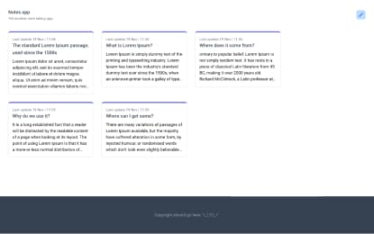
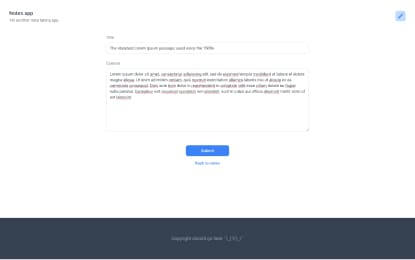
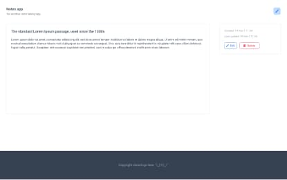
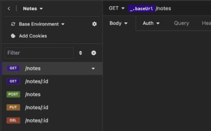

# Notes.app


### Briefly about

* Pet project, note taking app, made in less than 1 man day.
* Simple REST API on backend side.
* Next.js with app router on frontend side.

### Some screenshots






### Run

```shell
turbo dev
```

The above command will run both frontend and backend at the same time.

### Known issues

* Error `Warning: findDOMNode is deprecated in StrictMode` comes from Tremor-UI package, waiting for the error to be
  corrected on their side.

* Error `TypeError: Cannot read properties of null (reading 'removeChild')` appears randomly when `.module.scss` is
  saved, looks like weird Next.js issue, see:
  https://stackoverflow.com/questions/76903959/nextjs-typeerror-cannot-read-properties-of-null-reading-removechild-when
